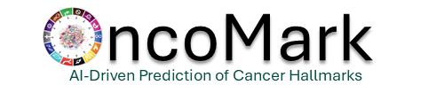

  

 

## Overview

**OncoMark** is an advanced computational tool designed to predict cancer hallmark activity from transcriptomic data derived from biopsy samples. Built on a robust **neural multi-task learning (N-MTL) framework**, OncoMark bridges a critical gap in molecular oncology by offering a comprehensive model to annotate and interpret hallmark activity for individual tumors. 

Developed through a collaborative effort between the research groups of [Prof. Shubhasis Haldar](https://www.shubhasis-haldar-cmt.com/) at the [SN Bose National Centre for Basic Sciences](https://www.bose.res.in/) and [Prof. Debayan Gupta](https://debayangupta.com/) at [Ashoka University](https://www.ashoka.edu.in/home/), OncoMark leverages cutting-edge computational methods to address the limitations of current molecular oncology approaches. This tool integrates state-of-the-art deep learning methodologies with domain-specific insights to enable precise and scalable hallmark analysis, advancing cancer diagnostics and treatment planning.

---

## Research in Context

### Evidence Before This Study

Despite significant advances in cancer research and machine learning, there has been no computational framework capable of **comprehensively predicting cancer hallmark activity** from tumor biopsy samples. Previous studies have predominantly focused on specific molecular pathways or hallmark subsets, leaving clinicians without an integrated model to interpret hallmark activity for individual patients. The lack of wet-lab methods to annotate hallmark activity in biopsy samples has further impeded progress, limiting the application of these insights in clinical practice. A literature search using terms such as **“(Predicting OR Classifying OR Annotating) AND (cancer hallmarks) AND (Deep OR Machine Learning) OR (Artificial Intelligence OR AI)”** highlighted this critical gap in computational oncology.

### Added Value of OncoMark

OncoMark addresses this unmet need by introducing a comprehensive neural multi-task learning (N-MTL) framework. This innovative tool employs synthetic biopsy datasets annotated with hallmark activity, reflecting real-world tumor biology while maintaining clinical relevance. Key features include:

- **Multi-task learning**: Captures interdependencies among cancer hallmarks, providing a holistic view of tumor biology beyond isolated predictions.
- **Extensive validation**: Demonstrated reproducibility and generalizability across six independent datasets with 159 patient samples. Additional external validation with over **20,000 samples** (11,679 cancer and 8,348 normal) reinforces its robustness.
- **Accessibility**: A user-friendly web interface allows seamless access for oncologists and researchers, promoting clinical integration.

By generating actionable insights into hallmark activity, OncoMark advances precision oncology, bridging the gap between computational and clinical oncology.

### Implications of All Available Evidence

OncoMark represents a transformative leap in cancer diagnostics. By systematically capturing hallmark interdependencies, it offers a deeper understanding of tumor behavior, paving the way for:

- **Individualized therapy development**: Enables the design of targeted, patient-specific treatments.
- **Enhanced clinical workflows**: Provides timely, cost-effective, and precise tumor analyses for oncologists worldwide.
- **Scalability**: Facilitates broad adoption in precision oncology through its user-centric design and validated predictive capabilities.

With ongoing validation and refinement, OncoMark holds the potential to revolutionize cancer care by delivering unparalleled precision in hallmark annotation and therapeutic decision-making.
